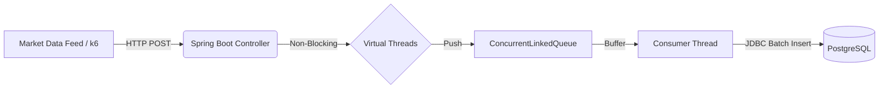

# High-Frequency Stock Ticker Ingestion Service


## 📖 Project Overview

This is a **high-throughput, low-latency microservice** designed to ingest real-time financial stock market data. The system is engineered to handle massive concurrent traffic spikes by decoupling the HTTP ingestion layer from the database persistence layer.

Tis project moves beyond standard CRUD operations to demonstrate **resource efficiency**, **concurrency control**, and **fault tolerance**.

### Key Achievements
* **15,000+ RPS** on local hardware using Virtual Threads.
* **1,250+ RPS** on constrained "Cloud-like" resources (1 vCPU).
* **Zero Data Loss** guaranteed via Graceful Shutdown implementation.
* **99.87% Availability** demonstrated during Chaos Engineering tests.

---

## 🏗 System Architecture

The system utilizes an **Asynchronous Producer-Consumer** pattern to smooth out "bursty" traffic before writing to disk.



### Design Decisions
1.  **Virtual Threads (Project Loom):** Utilized Spring Boot's virtual thread executor to handle high-concurrency HTTP connections with minimal memory overhead compared to platform threads.
2.  **Asynchronous Buffering:** The API returns `202 ACCEPTED` immediately upon validation, pushing data to a thread-safe `ConcurrentLinkedQueue`. This removes Database I/O from the request blocking path.
3.  **JDBC Batching:** Replaced standard JPA/Hibernate `save()` with `JdbcTemplate` batch updates (batch size: 1000) to reduce Network Round Trip Time (RTT) by orders of magnitude.
4.  **Graceful Shutdown:** Implemented `@PreDestroy` hooks to drain the in-memory buffer to the database upon `SIGTERM`, ensuring data integrity during deployments.

---

## 📊 Performance Benchmarks

*Hardware Context: Standard Dev Laptop testing against Docker Resource Limits.*

| Scenario | Infrastructure | Throughput (RPS) | P95 Latency | Analysis |
| :--- | :--- | :--- | :--- | :--- |
| **Baseline** | Local JVM (Unlimited CPU) | **~15,600 RPS** | 6.25ms | Raw application overhead is minimal. |
| **Bottleneck** | Docker (0.5 vCPU) | ~414 RPS | 297ms | **CPU Starvation.** High Context Switching observed. |
| **Sweet Spot** | Docker (1.0 vCPU) | **~1,250 RPS** | 96ms | **2.5x gain** by doubling CPU. Efficient vertical scaling. |
| **Resiliency** | 3-Node Cluster | ~300 RPS | 185ms | Load Balancer failover verified; Latency stable during node death. |

---

## 🛠️ Engineering Challenges & Solutions

### 1. The Database Bottleneck
* **Challenge:** Direct database writes on every API call capped throughput at ~200 RPS due to Disk I/O latency.
* **Solution:** Implemented an in-memory `ConcurrentLinkedQueue`. The API accepts the request instantly, and a background scheduler aggregates writes into batches of 1,000.
* **Result:** Throughput increased by **6x** with a persistent DB connection.

### 2. Resource Contention
* **Challenge:** Scaling horizontally from 1 to 3 pods on a single machine caused throughput to *drop* rather than increase.
* **Root Cause:** `docker stats` revealed high CPU Context Switching as the host OS thrashed between containers.
* **Takeaway:** Horizontal scaling requires physical capacity. Validated that Vertical Scaling (0.5 CPU -> 1.0 CPU) was the correct approach for this hardware profile.

### 3. Data Safety on Crash
* **Challenge:** Because data was buffered in RAM, a `SIGTERM` (Pod restart) would cause data loss of queued items.
* **Solution:** Added a Graceful Shutdown hook.
    ```java
    @PreDestroy
    public void onShutdown() {
        while (!buffer.isEmpty()) {
            flushBufferToDb(); // Drains the queue before JVM exits
        }
    }
    ```
* **Verification:** Verified **100% data integrity** (Row Count: 150,744 / 150,744) even when the container was stopped mid-load-test.

---

## 🚀 Running Locally (Config)

### Prerequisites
* Java 21+
* Docker & Docker Compose
* [k6](https://k6.io/) (for load testing)

### 1. Build the Application
```bash
mvn clean package -DskipTests
```

### 2. Run with Docker Compose
Starts the Application (Limit: 1 CPU, 512MB RAM) and PostgreSQL.
```bash
docker-compose up -d --build
```
* **App:** `http://localhost:8080`
* **DB:** Port `5432`

### 3. Run the Load Test
The project includes a custom k6 script to simulate 50 concurrent stock feed sensors.
```bash
k6 run k6/load-test.js
```

### 4. Verify Data Integrity
Check if all requests were persisted to PostgreSQL:
```bash
docker exec -it stock-postgres psql -U user -d stockdb -c "SELECT COUNT(*) FROM ticks;"
```

---

## 💻 Tech Stack Details

* **Language:** Java 21
* **Framework:** Spring Boot 4.0 (Web, JDBC)
* **Database:** PostgreSQL 15 (Production), H2 (Test)
* **Containerization:** Docker, Docker Compose
* **Testing:** k6 (Performance), Chaos Engineering
* **Key Libraries:** `spring-boot-starter-jdbc`, `lombok`

---

## 📝 Configuration Snippets

**`application.yaml` (Virtual Threads)**
```yaml
spring:
  threads:
    virtual:
      enabled: true
server:
  shutdown: graceful
```

**`docker-compose.yml` (Resource Constraints)**
```yaml
    deploy:
      resources:
        limits:
          cpus: '1.0'
          memory: 512M
```
